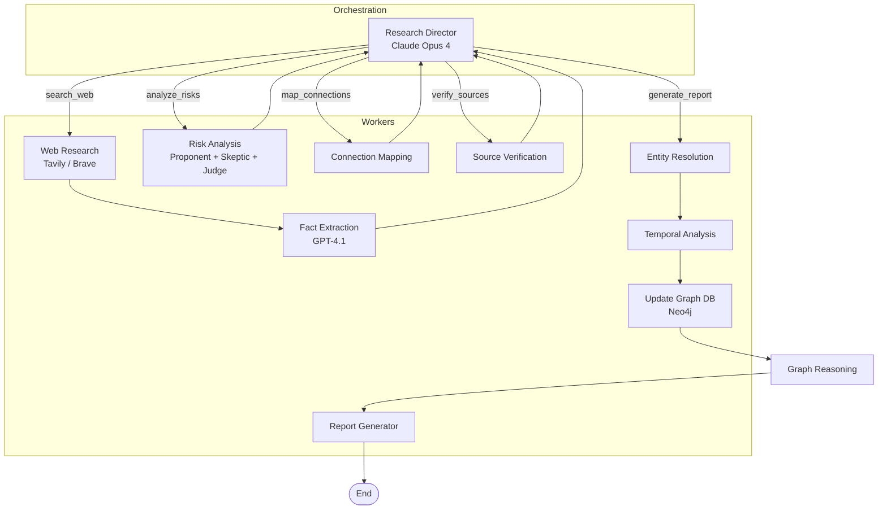

# Design Approach & Architecture

## Table of Contents
- [Overview](#overview)
- [System Architecture](#system-architecture)
- [Step-by-Step Agent Flow](#step-by-step-agent-flow)
- [Multi-Model Strategy](#multi-model-strategy)
- [Consecutive Search Strategy](#consecutive-search-strategy)
- [Prompt Engineering](#prompt-engineering)
- [Adversarial Risk Debate](#adversarial-risk-debate)
- [Temporal Intelligence](#temporal-intelligence)
- [Identity Graph & Neo4j](#identity-graph--neo4j)
- [Next.js Frontend & API](#nextjs-frontend--api)
- [Evaluation Framework](#evaluation-framework)
- [Error Handling & Resilience](#error-handling--resilience)
- [Observability](#observability)
- [Trade-offs & Decisions](#trade-offs--decisions)
- [Sample Run: Timothy Overturf](#sample-run-timothy-overturf)
- [Deployment & Production](#deployment--production)

---

## Overview

This project is an **autonomous Deep Research AI Agent** for due diligence investigations. Given a person’s name and optional context (role, organization), it:

1. **Autonomously plans** each step via a Research Director (LangGraph supervisor)
2. **Searches the web** in consecutive phases: Baseline → Breadth → Depth → Adversarial → Triangulation → Synthesis
3. **Extracts structured facts** as entities (Person, Organization, Location, Event, Document, Financial Instrument) and connections (e.g. WORKS_AT, BOARD_MEMBER_OF, FOUNDED) with confidence scores
4. **Analyses risk** through an **adversarial debate** (Risk Proponent vs Risk Skeptic, with a Judge) instead of a single classifier
5. **Maps connections** and **verifies sources** with authority scoring and cross-referencing
6. **Resolves entities** (fuzzy dedup, alias merging) and runs **temporal analysis** (timeline, contradiction detection)
7. **Generates a report** and optionally **persists an identity graph** to Neo4j

The agent is built as a **LangGraph state machine** with a single supervisor (Research Director) and multiple worker nodes. Termination is driven by **max iterations**, **diminishing returns** (recent iterations yield few new entities), and **cost budget** (default $5/run).

---

## System Architecture

### State Machine (LangGraph)

The graph is defined in `src/graph.py`. The **Director** is the only entry point; it decides the next action and routes to one of the worker nodes. After **web_research**, the pipeline always runs **fact_extraction** then returns to the Director. All other workers (risk_analysis, connection_mapping, source_verification) return to the Director. When the Director chooses **generate_report**, the flow goes: **entity_resolution** → **temporal_analysis** → **update_graph_db** → (optional) **graph_reasoning** → **generate_report** → END. Graph persistence runs *before* the report so that graph-derived insights can feed the narrative.



### Full System Overview

```
┌─────────────────────────────────────────────────────────────────────────────┐
│  FRONTEND                                                                   │
│  Next.js (:3000) — App Router, React Query, SSE for live progress          │
│  Reads outputs/ via API routes (GET /api/cases, GET /api/cases/[id],        │
│  GET /api/investigate/[id]/stream from progress.jsonl)                     │
└─────────────────────────────────────┬───────────────────────────────────────┘
                                      │
┌─────────────────────────────────────┴───────────────────────────────────────┐
│  BACKEND (CLI or spawned by POST /api/investigate)                            │
│  Python — LangGraph state machine (src/graph.py)                            │
│  State: ResearchState (Pydantic) serialized to dict at node boundaries      │
└─────────────────────────────────────┬───────────────────────────────────────┘
                                      │
        ┌─────────────────────────────┼─────────────────────────────┐
        ▼                             ▼                             ▼
   outputs/                      Neo4j (optional)              Prometheus
   *_state.json                  identity graph                (optional)
   *_report.md                   allowlisted Cypher            metrics
   *_entities.json
   *_progress.jsonl
```

---

## Step-by-Step Agent Flow

### 1. Research Director — `src/agents/research_director.py`
**Model**: Claude Opus 4 (DEEP tier) | **Role**: Supervisor

The Director receives the current **ResearchState** (entities, connections, risk_flags, search_history, hypotheses, current_phase, iteration) and decides:

- **Next action**: `search_web` | `analyze_risks` | `map_connections` | `verify_sources` | `generate_report` | `terminate`
- **Next phase**: One of Baseline, Breadth, Depth, Adversarial, Triangulation, Synthesis
- **Search queries** (if action is search_web): 2–5 diverse queries, informed by gaps and uninvestigated entities

**Termination conditions** (before calling the LLM):

1. **Max iterations reached** → GENERATE_REPORT, phase Synthesis
2. **Consecutive LLM failures** (e.g. 3 in a row) → GENERATE_REPORT so the run does not spin
3. **Diminishing returns**: last N iterations each yielded &lt; min new entities (config: `diminishing_returns_lookback_iterations`, `diminishing_returns_min_entities`) → GENERATE_REPORT
4. **Budget exhausted** (`BudgetExhaustedError` from LLM client when cost &gt; `cost_budget_usd`) → GENERATE_REPORT with current findings

**Key design**: The Director never performs search or extraction itself; it only plans. All execution is in worker nodes.

---

### 2. Web Research — `src/agents/web_researcher.py` + `src/tools/search.py`
**Tools**: Tavily (primary), Brave (fallback) | **Execution**: Per-query search, result deduplication

Given the Director’s 2–5 search queries and the current **SearchPhase**, the Web Research node:

- Runs each query through the search stack (Tavily and/or Brave, with provider selection and retries)
- Deduplicates results by URL across the run
- Appends raw content (snippets or full fetch via tiered URL fetch) to **pending_content** for fact extraction
- Records each search in **search_history** (query, provider, phase, timestamp)

**Phase-aware behaviour**: In Adversarial and Triangulation phases, the system can use both “baseline” and “adversarial” style queries to balance coverage and negative-signal search.

---

### 3. Fact Extraction — `src/agents/fact_extractor.py`
**Model**: GPT-4.1 or configured FAST model | **Temperature**: Low for structured output

Reads **pending_content** (batched by token budget), calls the LLM with a structured prompt, and extracts:

- **Entities**: Person, Organization, Location, Event, Document, Financial Instrument (with name, type, confidence, attributes, source_urls)
- **Connections**: Subject–predicate–object triples (e.g. Person — WORKS_AT → Organization) with confidence
- **Facts**: For state and report context

**Batching**: Content is split into batches (e.g. by 8k-character chunks); each batch is one LLM call. Progress is logged (`fact_extraction_batch_start` / `fact_extraction_batch_done`) for observability.

**Fuzzy dedup**: Optional **entity_fuzzy_threshold** (rapidfuzz) merges entities that are likely the same (e.g. “Sisu Capital” vs “Sisu Capital, LLC”). New entities and connections are merged into **state.entities** and **state.connections** with deduplication.

**Output**: Pending content is cleared; **entities_added_per_iteration** is updated for diminishing-returns logic.

---

### 4. Risk Analysis — `src/agents/risk_analyzer.py` + `src/agents/risk_debate.py`
**Models**: Risk Proponent & Risk Skeptic (FAST: Sonnet / GPT-4.1-mini / Gemini Flash); Judge (DEEP: Claude Opus 4)

Risk is not produced by a single classifier. The pipeline uses an **adversarial debate**:

1. **Risk Proponent**: Argues for the presence and severity of risks given the evidence (aggressive interpretation).
2. **Risk Skeptic**: Argues against over-interpretation, points to alternative explanations, and down-weights weak evidence.
3. **Risk Judge**: Consumes the debate transcript and the same evidence, then outputs **risk flags** with category, severity, confidence, and rationale.

**Categories**: regulatory, litigation, financial, reputational, association, inconsistency, sanctions, political_exposure (from `src/models.py`).

**Output**: **state.risk_flags** is updated; **risk_debate_transcript** is stored in state and can be shown in the UI for auditability.

**Fallback**: If the primary Judge model fails (e.g. rate limit), the LLM client can fall back to a secondary model; the run continues with a logged warning.

---

### 5. Connection Mapping — `src/agents/connection_mapper.py`
**Model**: Claude Opus 4 (DEEP)

Enriches **state.connections** by inferring multi-hop or implicit relationships from entities and existing facts. Connections use the same schema as fact extraction (subject, object, relationship type, confidence). This feeds the identity graph and the report’s “network” view.

---

### 6. Source Verification — `src/agents/source_verifier.py`
**Model**: Claude Opus 4 (DEEP)

Cross-references claims across **search_history** and source URLs. Updates **confidence_scores** and can flag contradictions. Source authority is configurable (e.g. SEC, courts, major news = high authority; see `src/config.py` and `SourceReference.compute_authority` in `src/models.py`).

---

### 7. Entity Resolution — `src/agents/entity_resolver.py`
**Tool**: Fuzzy matching (e.g. rapidfuzz), no LLM

Runs when the Director chooses **generate_report**. Deduplicates and merges entities (e.g. aliases, name variants) so the graph and report refer to a single canonical set of entities. Uses **entity_fuzzy_threshold** when enabled.

---

### 8. Temporal Analysis — `src/agents/temporal_analyzer.py`
**Model**: Claude Opus 4 (DEEP)

Builds **temporal facts** (facts anchored to date ranges) and detects **temporal contradictions** (e.g. “Person suspended 2017–2019” vs “Person provided advice 2017–2021”). Contradictions are stored with severity and confidence and can surface as risk or in the report. This is one of the key differentiators of the agent.

---

### 9. Report Generation — `src/agents/report_generator.py`
**Model**: Claude Opus 4 (DEEP)

Synthesizes **state.final_report** (markdown) from entities, connections, risk_flags, temporal facts, and graph insights. The report structure typically includes executive summary, subject profile, organizational connections, risk assessment, key findings, confidence assessment, and recommendations. Citations and evidence are traceable to source URLs and entity/connection IDs.

---

### 10. Update Graph DB — `src/graph_db/neo4j_client.py`
**Tool**: Neo4j (optional, `enable_graph_db`)

**Before** the report, **update_graph_db** persists the identity graph to Neo4j: nodes for entities (allowlisted labels) and relationships from **state.connections** (allowlisted types). Nodes and edges get **investigation_id** and **updated_at** for provenance and future “what changed” queries. **ensure_indexes()** creates indexes on common lookup keys (e.g. name, severity). If Neo4j is unavailable, the run logs and continues; **graph_db_populated** is set so the next node (graph_reasoning or generate_report) is chosen accordingly.

**Graph insights**: Update_graph_db runs inline discovery (degree centrality, shortest paths, shell companies) and appends to **state.graph_insights**. The optional **graph_reasoning** node then runs additional discovery queries (see below).

### 11. Graph Reasoning — `src/agents/graph_reasoner.py`
**Tool**: Neo4j (read-only), runs only when graph was just populated

Runs a fixed set of **discovery queries** (e.g. hidden_intermediaries, risk_proximity, hub_entities, shared_addresses, temporal_overlap, isolated_clusters) against the persisted graph. Results are appended to **state.graph_insights** as **GraphInsight**-style entries (query_name, description, insight_type, results). The report generator and Jinja template consume **graph_insights** to add a “Network Analysis” section. See **docs/implementation-plan-graph-reasoning.md**.

---

## Multi-Model Strategy

| Agent / Task              | Tier | Model(s)                          | Rationale |
|---------------------------|------|-----------------------------------|-----------|
| Research Director         | DEEP | Claude Opus 4                     | Planning, phase transitions, termination, query generation |
| Fact Extraction           | FAST | GPT-4.1 or configured fast model | High volume, structured JSON; speed matters |
| Risk Proponent / Skeptic  | FAST | Sonnet / GPT-4.1-mini / Gemini Flash | Adversarial arguments; throughput over peak reasoning |
| Risk Judge / Connections / Verify / Report | DEEP | Claude Opus 4 | Nuanced reasoning, synthesis, citation-aware writing |
| Temporal Analysis         | DEEP | Claude Opus 4                     | Timeline and contradiction reasoning |

**Cost control**: The LLM client tracks estimated cost per call. When cumulative cost exceeds **cost_budget_usd** (default 5.0), it raises **BudgetExhaustedError**; the Director catches it and switches to GENERATE_REPORT so the run finishes with existing findings instead of aborting.

**Fallback**: Configurable model fallbacks (e.g. primary → secondary provider) for transient failures (rate limits, 5xx). See `src/llm_client.py` (TransientError, retries, fallback model).

---

## Consecutive Search Strategy

Search is organised in **phases** (see `SearchPhase` in `src/models.py`):

1. **Baseline** — Initial biographical and role context.
2. **Breadth** — Broader landscape (entities, orgs, locations).
3. **Depth** — Deep dive on specific entities and topics.
4. **Adversarial** — Queries aimed at negative signals (litigation, sanctions, controversy).
5. **Triangulation** — Cross-checking and corroboration across sources.
6. **Synthesis** — No new search; Director moves to report generation.

The **Director** chooses the next phase and the next action. Phases are not strictly sequential: the Director can repeat or skip phases based on state (e.g. “already in Depth, few new entities last iteration → try Adversarial or move to Synthesis”). **Diminishing returns** (last N iterations each with &lt; min new entities) triggers a move to Synthesis.

---

## Prompt Engineering

Prompts live in **src/prompts/templates.py**. Design principles:

- **Structured output**: Director returns a structured decision (action, phase, search_queries, reasoning). Fact extractor and risk judge return JSON with well-defined fields.
- **Context injection**: Director receives current entities, connections, risk_flags, search_history, hypotheses, and iteration so it can avoid duplicate queries and focus on gaps.
- **Anti-hallucination**: Instructions to only use information present in the provided content; no fabricating entities or relationships.
- **Evidence and citations**: Risk flags and report sections should cite sources; source URLs are passed through state.

Phase-specific hints (e.g. “Adversarial: focus on litigation, regulatory, negative press”) are encoded in Director prompts so that generated queries match the intended phase.

---

## Adversarial Risk Debate

Implemented in **src/agents/risk_debate.py** and **src/agents/risk_analyzer.py**.

- **Proponent** and **Skeptic** each receive the same evidence (entities, connections, facts) and produce arguments (e.g. “Risk: SEC action against X” vs “Mitigation: no final judgment yet”).
- The **Judge** receives the debate transcript plus evidence and outputs a list of **risk flags** (category, severity, confidence, title, description). The transcript is stored in **state.risk_debate_transcript** for transparency and UI display.

This reduces single-model bias and encourages the system to surface both concerning and mitigating factors before assigning severity.

---

## Temporal Intelligence

Implemented in **src/agents/temporal_analyzer.py** and **TemporalFact** / **TemporalContradiction** in **src/models.py**.

- **Temporal facts**: Facts with date ranges (e.g. “Hans Overturf suspended 2017–2019”).
- **Contradictions**: Pairs of temporal facts that conflict (e.g. suspended in 2017–2019 vs provided advice 2017–2021). Each contradiction has severity and confidence and can be raised as a risk or highlighted in the report.

The temporal analyzer runs after entity resolution and before report generation so the report can reference both timeline and contradictions.

---

## Identity Graph & Neo4j

- **In-memory state**: **state.entities** and **state.connections** form the graph used by the report and the UI during the run.
- **Neo4j** (optional): Before report generation, **update_graph_db** persists this graph to Neo4j; then **graph_reasoning** runs discovery queries and appends to **graph_insights**. Schema uses **allowlisted** node labels and relationship types (see ADR 003) so that Cypher is built from fixed enums, not user input, avoiding injection.
- **Graph insights**: Queries such as degree centrality can be run against Neo4j (or the in-memory graph) and stored in **state.graph_insights** for the “Network” tab and report.

The frontend **Graph** tab (React Flow) reads entities and connections from the case API and renders an interactive graph; it does not query Neo4j directly. Neo4j is used for persistence and server-side analytics.

---

## Next.js Frontend & API

- **Stack**: Next.js (App Router), React Query, Tailwind, shadcn-style components. Dark theme aligned with “Intelligence Console” (orange primary, risk colours).
- **Data source**: The frontend does not run the Python graph itself in production; it reads from the **outputs** directory via Next.js API routes. When an investigation is started via **POST /api/investigate**, the backend spawns the Python process and writes **outputs/{id}_state.json**, **outputs/{id}_report.md**, **outputs/{id}_entities.json**, **outputs/{id}_progress.jsonl**, etc.
- **List and detail**: **GET /api/cases** lists cases by scanning for `*_state.json`. **GET /api/cases/[id]** returns the full case (state, report, entities, risk_flags, logs, etc.). Logs can come from **state.logs** or, when absent, from **{id}_progress.jsonl** (see route logic).
- **Live progress**: **GET /api/investigate/[id]/stream** streams Server-Sent Events by tailing **outputs/{id}_progress.jsonl**. Events include `node_start`, `log`, `facts_update`, `entities_update`, `risks_update`, `complete`.
- **Deployed demo**: **outputs_captured/** holds a fixed set of investigations (e.g. Timothy Overturf, Jensen Huang, Adam Neumann, Sam Altman) and is copied into the Docker image as **outputs** so the deployed app can show pre-built cases without running the backend.

---

## Evaluation Framework

- **Location**: **src/evaluation/eval_set.py** (personas, expected facts/entities/connections), **src/evaluation/metrics.py** (scoring).
- **Personas**: Easy (e.g. Jensen Huang), Medium (e.g. Michael Moritz, Adam Neumann), Hard (Timothy Overturf). Each persona has **expected_facts**, **expected_entities**, **expected_connections** (and optional **expected_risk_flags**). **get_persona(name)** accepts difficulty ("easy" / "medium" / "hard") or full name.
- **Metrics**: Fact recall, entity recall, connection recall; **depth-weighted** scoring for facts (surface vs deep vs hidden). Results written to **outputs/evaluations/**.
- **CLI**: `python -m src.main evaluate --persona easy` or `--persona "Sam Altman"` or `--all`.

---

## Error Handling & Resilience

- **Director**: Catches **BudgetExhaustedError** and consecutive LLM failures; always returns a decision (GENERATE_REPORT) so the graph never blocks indefinitely.
- **LLM client**: Retries on **TransientError** (rate limit, 5xx, timeouts); fails fast on **PermanentError** (auth, 4xx). Tracks cost and enforces **cost_budget_usd**. Optional model fallback when primary provider fails.
- **Search**: Tavily and Brave with retries and fallback; failed searches are logged and do not crash the run.
- **Neo4j**: If **enable_graph_db** is true but Neo4j is unreachable, the update_graph_db node logs and continues; the rest of the state (report, entities, connections) is still written to **outputs/**.
- **Structlog**: All nodes use structlog; in CLI mode a Rich-based processor formats phase banners, node headers, and event-specific colours (e.g. fact extraction, risk, phase transitions). Errors are logged with context and not re-raised where the design allows graceful degradation.

---

## Observability

- **Log capture**: Optional capture of structlog events into **state.logs** (see **src/observability/log_capture.py**) so the UI “Execution log” tab shows a full run transcript.
- **Progress file**: **{slug}_progress.jsonl** is appended per run; each line is a JSON event (node_start, log, complete, etc.). The Next.js stream API reads this file to drive live SSE.
- **Prometheus** (optional): When **PROMETHEUS_METRICS_ENABLED** is true, the app exposes metrics (e.g. investigation duration, cost, entity count, risk flags). See **src/observability/metrics.py** and **docs/observability-guide.md**. Grafana dashboards can be wired to Prometheus.
- **LangSmith** (optional): When tracing is enabled, LangGraph/LangChain calls can be sent to LangSmith for trace inspection.

---

## Trade-offs & Decisions

| Decision | Chosen | Alternative | Why |
|----------|--------|-------------|-----|
| Orchestration | LangGraph (single Director) | Multi-agent handoffs, pure chains | Single supervisor keeps control flow explicit; conditional edges from Director map cleanly to “one action per step”. |
| Search phases | Six phases (Baseline → Synthesis) | Flat search, two-phase | Phases give structure (breadth → depth → adversarial) and allow the Director to reason about “what to do next”. |
| Risk | Adversarial debate (Proponent + Skeptic + Judge) | Single risk classifier | Reduces bias; Judge sees both sides; transcript is auditable. |
| Fact extraction model | FAST (e.g. GPT-4.1) | DEEP for everything | Extraction is high-volume and structured; DEEP reserved for Director, Judge, report, temporal. |
| Graph persistence | Neo4j (optional) | In-memory only, SQLite | Neo4j fits identity graph and path queries; optional so the app runs without Docker when disabled. |
| Frontend data | Read outputs/ via API | Real-time DB, WebSockets | Simpler: backend writes files; frontend and API read them. SSE from progress.jsonl gives “live” feel without a shared DB. |
| Deployment | Docker (Next.js + Python in one image) | Separate services | Single image for Railway/deploy; Python invoked by Next.js API route for POST /api/investigate. |
| Demo data | outputs_captured/ in repo | No pre-built cases | Deployed app can show Timothy Overturf and others without running investigations. |

---

## Sample Run: Timothy Overturf

**Target**: Timothy Overturf, CEO of Sisu Capital.

- **Phases**: Director progresses through Baseline, Breadth, Depth, Adversarial, Triangulation, then Synthesis.
- **Discovery**: Entities (e.g. Sisu Capital, Hansueli Overturf), connections (e.g. Timothy — CEO — Sisu Capital), risk flags (SEC, regulatory, litigation).
- **Temporal**: Contradictions such as “Hansueli Overturf suspended 2017–2019” vs “provided advice 2017–2021” are detected and flagged.
- **Adversarial**: Proponent and Skeptic debate evidence; Judge outputs severity and confidence.
- **Output**: **state.json**, **report.md**, **entities.json**, optional Neo4j graph; **graph_insights** (e.g. degree centrality) for UI.

**Captured runs**: **outputs_captured/** includes timothy_overturf (and jensen_huang, adam_neumann, sam_altman) so the deployed site can list and open these cases and show reports, graphs, and execution logs (from state.logs or progress.jsonl).

---

## Deployment & Production

- **Build**: Dockerfile builds the app (Python backend deps, Next.js frontend). **outputs_captured/** is copied into the image as **outputs** so the UI has demo cases.
- **Config**: Environment variables (`.env`) for API keys (Anthropic, OpenAI, Google, Tavily, Brave, Neo4j), **COST_BUDGET_USD**, **max_search_iterations**, diminishing-returns and fuzzy-dedup settings. No secrets in code or logs.
- **Scaling**: Current design is single-run (one investigation at a time per process). For multiple concurrent runs, you would add a job queue and worker processes; the graph and outputs layout support multiple case IDs.
- **Security**: Input validation and allowlisted Cypher/SQL patterns; SEC User-Agent and SSRF-safe fetch (see ADRs and security section in README).

---

This document reflects the architecture and approach as implemented in the **ai-assessment** codebase (Deriv AI Engineer Technical Assessment). For implementation details, see **src/graph.py**, **src/agents/** and **src/models.py**, and the ADRs in **docs/decisions/**.
