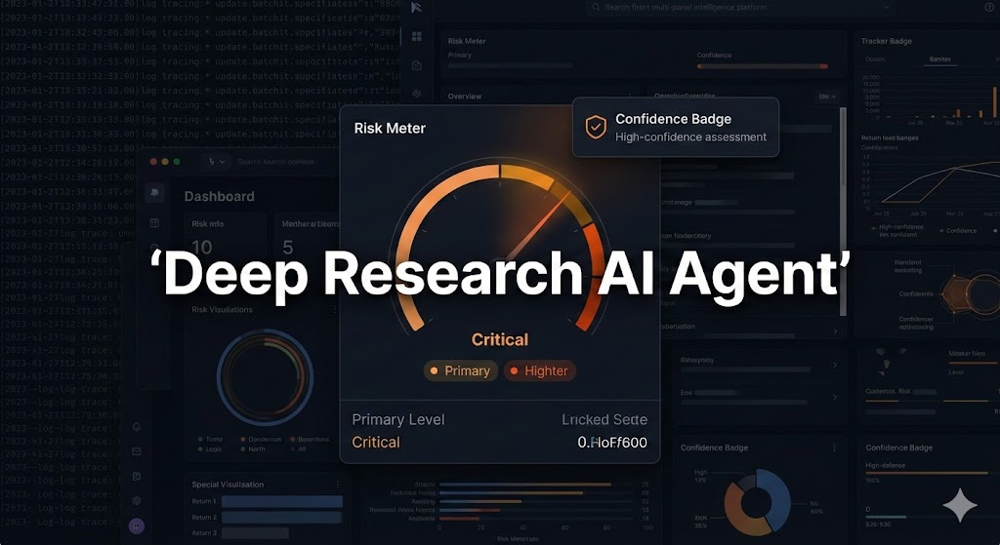
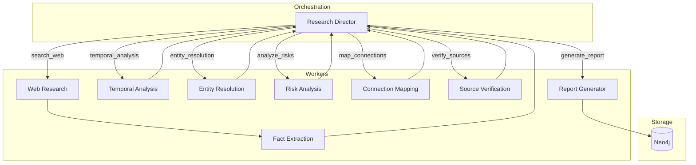
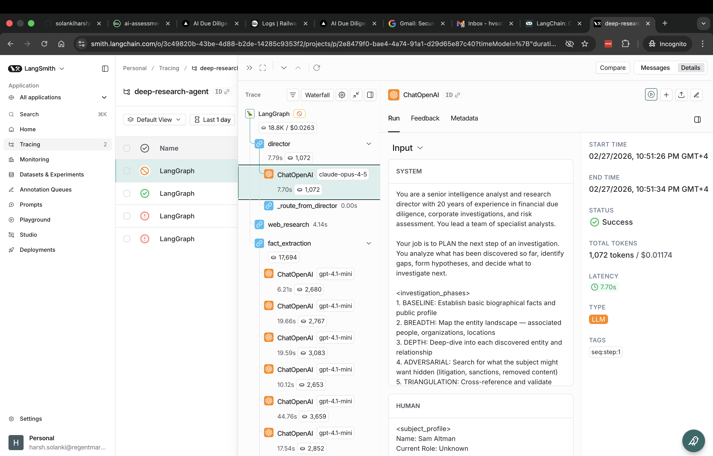
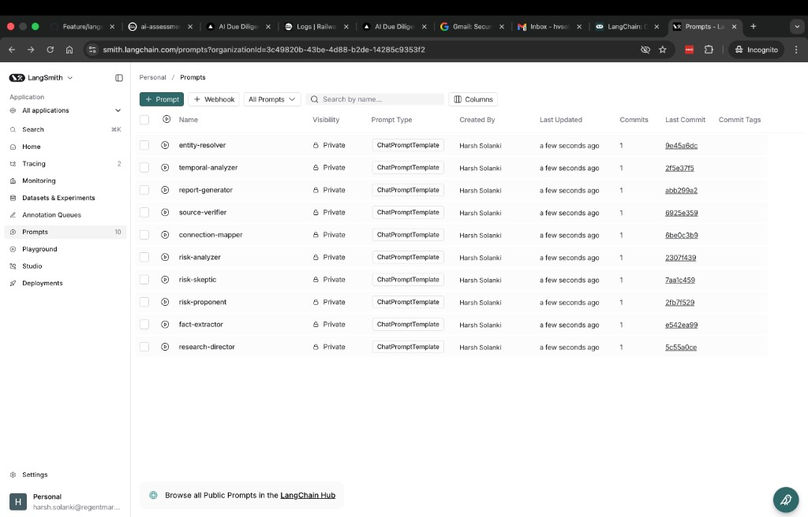

# Deep Research AI Agent

Autonomous intelligence-gathering agent for due diligence investigations. Built for the **Deriv AI — AI Engineer Technical Assessment**.



## Features & Functionality

### Core capabilities

- **Autonomous investigation** — Subject name plus optional role and organization; consecutive search phases: Baseline → Breadth → Depth → Adversarial → Triangulation → Synthesis.
- **Multi-model integration** — Claude Opus 4 (Director, risk, connections, report), GPT-4.1 (fact extraction), Gemini 2.5 (available); **two-tier cost strategy** (DEEP vs FAST) with configurable fast models for extraction and risk-debate agents.
- **Dynamic query refinement** — Research Director plans the next step from state (entities, hypotheses, gaps) and emits 2–5 search queries per step; no repeated queries.
- **Deep fact extraction** — Entities (Person, Organization, Location, Event, Document, Financial Instrument), connections (e.g. WORKS_AT, BOARD_MEMBER_OF, FOUNDED), optional **fuzzy dedup** (rapidfuzz, `entity_fuzzy_threshold`).
- **Risk pattern recognition** — Risk flags by category (regulatory, litigation, financial, reputational, association, inconsistency, sanctions, political_exposure) and severity; **adversarial debate** (Risk Proponent + Risk Skeptic agents, judge in risk analyzer).
- **Connection mapping** — Multi-hop relationships; **source verification** with confidence scoring and cross-referencing.
- **Identity graph** — Neo4j persistence after report (optional, `enable_graph_db`); allowlisted Cypher labels.
- **Cost budget and diminishing returns** — Per-run budget (default $5); early termination when the last N iterations yield few new entities.

### CLI and TUI

- **`investigate`** — `name`, `--role`, `--org`, `--max-iter`, `--output`, `--budget`, `--debug` (per-iteration JSON snapshots to `output_dir/{subject_slug}/iteration_N.json`), `--live` (Rich live progress: phase, stats, log, elapsed/cost).
- **`evaluate`** — Run against three test personas (easy / medium / hard); metrics and JSON under `outputs/evaluations/`.
- **Outputs** — `{subject_slug}_report.md`, `{subject_slug}_state.json`, `{subject_slug}_entities.json` in `outputs/` (or `--output`).

### Configuration and tooling

- **Pydantic Settings** from `.env`: LLM API keys (Anthropic, OpenAI, Google), Tavily/Brave search, Neo4j, agent tuning (max iterations, confidence threshold, diminishing-returns params, cost budget, fuzzy threshold).
- **`scripts/check_env.py`** — Validates all API keys from `.env` (run before `make run` or long investigations).
- **Docker Compose** for local Neo4j (`make docker-up`). Optional **Prometheus + Grafana** for observability (see [Observability](#observability) and [ADR 011](docs/decisions/011-observability-stack.md)).

### Evaluation

- Three personas with expected facts, entities, and connections; **depth-weighted scoring** (facts at depth 1–5, weighted recall); metrics (fact recall, entity recall, connection recall, `weighted_score`, `depth_breakdown`); outputs under `outputs/evaluations/`.

### Key innovations (examples from Timothy Overturf run)

Three capabilities differentiate the agent; the following use real output from a run on **Timothy Overturf** (Sisu Capital):

1. **Temporal intelligence** — Facts are anchored to date ranges; the pipeline detects contradictions across the timeline. Example: *Hansueli Overturf suspended 2017–2019, yet provided advice 2017–2021* → **CONTRADICTION** flagged, severity: critical, confidence: 0.90. See `src/agents/temporal_analyzer.py` and `TemporalFact` / `TemporalContradiction` in `src/models.py`.

2. **Adversarial risk debate** — Risk is not a single classifier. A **Risk Proponent** and **Risk Skeptic** argue from the same evidence; the **Risk Analyzer** (judge) produces severity and confidence. The debate transcript is stored in state and shown in the UI for auditability. See `src/agents/risk_analyzer.py` and `src/agents/risk_debate.py`.

3. **Identity graph reasoning** — After the report, the pipeline runs graph insights (e.g. degree centrality) over the entity network. Example from the same run: **Timothy Overturf: 36 connections**, **Sisu Capital, LLC: 20 connections**, **Hansueli Overturf: 11 connections**. The UI "Network" tab shows "Most connected" and the Risk tab can show graph insight tables. See `src/graph.py` (graph_insights) and Neo4j in [ADR 003](docs/decisions/003-neo4j-graph-database.md).

### Risk score interpretation

The UI and report present a numeric risk score derived from risk flags (count and severity). Interpretation:

| Score range | Interpretation |
|------------|----------------|
| 0–20       | Low — Few or no material risk flags |
| 21–50      | Medium — Some regulatory, litigation, or reputational flags |
| 51–100     | High — Multiple serious flags; review recommended |

### API and usage

- **CLI** — `python -m src.main investigate "Subject Name" --role ... --org ...` (see Usage below).
- **Frontend API** (Next.js): See [frontend spec](docs/frontend-console-prompt.md) for the full contract; the backend is API-first so wrapping in FastAPI is on the order of a couple of hours. Endpoints:
  - **POST** `/api/investigate` — Start an investigation (subject, role, org); runs pipeline and writes outputs to `outputs/`.
  - **GET** `/api/cases` — List investigation cases (reads from `outputs/`).
  - **GET** `/api/cases/[id]` — Get a single case (state, report, entities).
  - **GET** `/api/investigate/[id]/stream` — Server-Sent Events stream of progress (phase, search queries) while a run is active.

### Security

- **Input** — Subject name and query parameters are validated and sanitized; no raw user input is passed to shell or SQL.
- **Secrets** — API keys and credentials live in `.env`; no secrets are logged (PII/tokens redacted in structlog).
- **SEC.gov** — All requests to `sec.gov` use a compliant User-Agent with contact email (`SEC_CONTACT_EMAIL`); see [ADR 006](docs/decisions/006-sec-gov-fetching-strategy.md).
- **Fetch** — Tiered URL fetch validates targets; private IP ranges and blocked hostnames are rejected (SSRF mitigation). Optional crawl4ai tier, when enabled, follows the same allowlist. For log messages (dead URLs, Wayback recovery, `web_fetch_error`, `tier2_playwright_error`) and optional HTTP/2 handling, see [FETCH_LOGS_AND_RECOVERY.md](docs/FETCH_LOGS_AND_RECOVERY.md).

## Architecture

The system uses a **Supervisor–Worker pattern** in LangGraph: a Research Director plans each step and routes to specialized agents (search, extraction, risk analysis, connection mapping, source verification, report generation).



## Multi-Model Strategy

| Agent | Tier | Model | Rationale |
|-------|------|--------|-----------|
| Research Director | DEEP | Claude Opus 4 | Planning, phase transitions, termination |
| Fact Extraction | FAST | GPT-4.1 / fast | Structured JSON extraction |
| Risk (debate: Proponent/Skeptic) | FAST | Sonnet / GPT-4.1-mini / Gemini Flash | Adversarial arguments |
| Risk (judge) / Connections / Verify / Report | DEEP | Claude Opus 4 | Nuanced reasoning, synthesis |

## Consecutive Search Strategy

1. **Baseline** — Biographical facts, public profile  
2. **Breadth** — Entity landscape (people, orgs, locations)  
3. **Depth** — Deep-dive each entity  
4. **Adversarial** — Litigation, sanctions, negative signals  
5. **Triangulation** — Cross-reference across sources  
6. **Synthesis** — Risk assessment and report  

The Director uses **diminishing returns** (e.g. last N iterations yield few new entities) to terminate early when appropriate. **Cost budget** (default $5/run) can be set via `COST_BUDGET_USD` or `--budget`.

## Setup

**Backend only:**

```bash
make venv
make install
# Edit .env with API keys (Anthropic, OpenAI, Google, Tavily, Brave, Neo4j)
```

**Backend + frontend (full stack):**

```bash
make install-all
# Edit .env with API keys, then:
make run-quick    # optional: run one investigation so the console has data
make dev          # start Next.js console at http://localhost:3000
```

Optional: start Neo4j locally:

```bash
make docker-up
# Set NEO4J_URI=bolt://localhost:7687 and NEO4J_PASSWORD in .env
```

## Usage

```bash
# Investigate a person
python -m src.main investigate "Timothy Overturf" --role CEO --org "Sisu Capital"

# Quick test (fewer iterations)
make run-quick

# With cost budget (USD)
python -m src.main investigate "Jensen Huang" --role CEO --org NVIDIA --budget 5

# Run evaluation on test personas
python -m src.main evaluate --all
python -m src.main evaluate --persona easy
```

Outputs are written to `outputs/` (or `--output`): `{name}_report.md`, `{name}_state.json`, `{name}_entities.json`.

**Console & UI** — CLI plus Rich TUI (`--live`). A Next.js investigative console is in `frontend/`: run `make dev` (or `make frontend`) to start it at http://localhost:3000; it reads `outputs/` via API routes. See [Frontend console prompt](docs/frontend-console-prompt.md) for the API contract and [frontend/README.md](frontend/README.md) for run instructions.

### Observability

When enabled, the agent exposes **Prometheus metrics** on a configurable port and can be monitored via **Grafana**. See [docs/observability-guide.md](docs/observability-guide.md) and [ADR 011](docs/decisions/011-observability-stack.md).

- **Enable metrics**: Set `PROMETHEUS_METRICS_ENABLED=true` and optionally `PROMETHEUS_METRICS_PORT=8000` in `.env`. The CLI starts a non-blocking `/metrics` server when you run an investigation.
- **Start stack**: `docker compose up -d neo4j prometheus grafana`. Grafana at http://localhost:3001 (admin / research). Dashboard: http://localhost:3001/d/deep-research-monitor.
- **Run investigation**: `python -m src.main investigate "Subject Name" --role ... --org ...`. Prometheus scrapes the agent at `host.docker.internal:8000` while the run is active.

#### LangSmith tracing

LangGraph runs are traced to [LangSmith](https://smith.langchain.com) when tracing is enabled, so you can visualize, debug, and analyze each investigation (waterfall view, token usage, cost, and step-level details).

- **Enable tracing**: Set `LANGCHAIN_TRACING_V2=true`, `LANGCHAIN_API_KEY` (your LangSmith API key), and `LANGCHAIN_PROJECT=deep-research-agent` in `.env`. Runs then appear under the **Tracing** tab for the project.
- Each trace shows the full LangGraph execution (director → entity_resolution → temporal_analysis → generate_report → update_graph_db, etc.) with latency and token/cost per step. The **generate_report** step (e.g. ChatOpenAI / Claude) is typically the main contributor to duration and cost.



#### Push prompts to LangSmith

To sync the agent’s prompt templates (Research Director, Fact Extractor, Risk Analyzer, etc.) to LangSmith so you can edit and version them in the UI:

```bash
# Set LANGCHAIN_API_KEY in .env, then:
uv run python scripts/push_prompts_to_langsmith.py
# Or dry-run first:
uv run python scripts/push_prompts_to_langsmith.py --dry-run
```

Prompts are created in your LangSmith workspace with plain names (e.g. `research-director`, `fact-extractor`). Use `--prefix your-handle` to push under `your-handle/name` (the prefix must be your LangSmith tenant/org handle).



## Project Structure

```
src/
  main.py           # CLI
  config.py         # Settings (Pydantic)
  models.py         # State, entities, connections, risk flags
  graph.py          # LangGraph state machine
  llm_client.py     # Multi-model client (budget, retry)
  observability/    # Prometheus metrics (metrics.py)
  agents/           # Director, web researcher, fact extractor, risk, connections, verifier, report
  tools/search.py   # Tavily + Brave + WebFetcher
  graph_db/         # Neo4j client (allowlisted labels)
  prompts/          # Agent templates
  evaluation/       # Personas + metrics
monitoring/         # Prometheus + Grafana config and dashboards
tests/
  test_models.py
  test_search.py
  test_graph.py
  test_llm_client.py
  test_agents.py
docs/decisions/     # ADRs
```

## Design Decisions

Architectural choices are documented in `docs/decisions/` (ADRs). Summary:

- **LangGraph over chains**: Cycles and conditional routing (see [ADR 001](docs/decisions/001-langgraph-over-chains.md)).
- **Multi-model**: Task–model mapping for quality and cost (see [ADR 002](docs/decisions/002-multi-model-strategy.md)).
- **Neo4j**: Identity graph with allowlisted labels to avoid Cypher injection (see [ADR 003](docs/decisions/003-neo4j-graph-database.md)).
- **Tavily + Brave**: Primary + fallback and triangulation (see [ADR 004](docs/decisions/004-tavily-brave-dual-search.md)).
- **Fuzzy entity dedup**: Optional `rapidfuzz`-based merge (config: `entity_fuzzy_threshold`).
- **Budget**: Per-run cost cap; `BudgetExhaustedError` triggers graceful report generation.

## Tests

```bash
make test
# or
pytest tests -v
```

## License

MIT
